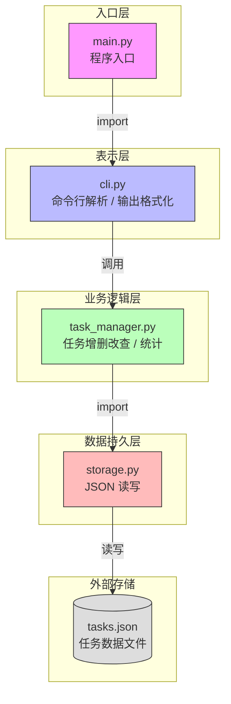
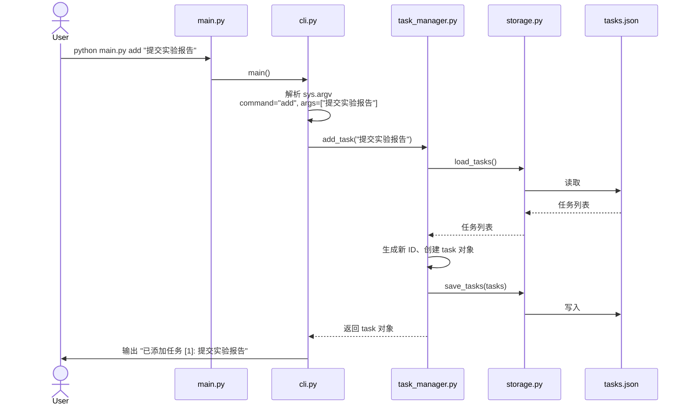

# CampusTask — 校园任务清单（模块化重构）

命令行任务管理工具，支持添加、查看、标记完成、删除、搜索和统计任务。数据持久化到 `tasks.json`。

实验一的基础上进行模块化重构，解耦数据存储、业务逻辑和命令行接口。

## 项目结构

```
实验二/
├── main.py           # 程序入口
├── cli.py            # 命令行参数解析与命令分发
├── task_manager.py   # 业务逻辑（增删改查、统计）
├── storage.py        # JSON 文件读写
└── tasks.json        # 任务数据（运行时自动生成）
```

## 使用方法

```bash
# 添加任务
python main.py add "完成软件工程实验2"

# 查看所有任务
python main.py list

# 完成任务（1 为任务编号）
python main.py done 1

# 删除任务
python main.py delete 1

# 搜索任务（支持模糊匹配）
python main.py search "实验"

# 统计信息
python main.py stats
```

## 数据结构

每个任务包含以下字段：

| 字段 | 类型 | 说明 |
|------|------|------|
| id | int | 任务编号，唯一且递增 |
| title | string | 任务标题 |
| status | string | todo（待办）或 done（已完成） |
| created_at | string | 创建时间，格式 YYYY-MM-DD HH:MM:SS |

## 架构关系图

### 模块依赖关系



### 命令执行流程（以 `add` 为例）



### 项目文件结构

```
实验二/
├── main.py           # 程序入口，仅负责启动
├── cli.py            # 命令行解析、命令分发、结果输出
├── task_manager.py   # 核心业务逻辑（增删改查 + 统计）
├── storage.py        # JSON 文件读写，可替换为数据库
├── tasks.json        # 任务数据（运行时自动生成）
├── .venv/            # Python 虚拟环境
└── README.md
```

## 模块职责

| 模块 | 职责 | 对外接口 |
|------|------|----------|
| storage | JSON 文件读写 | load_tasks(), save_tasks() |
| task_manager | 业务逻辑 | add_task(), list_tasks(), done_task(), delete_task(), search_tasks(), get_stats() |
| cli | 命令行解析与输出 | main(), dispatch(), print_usage() |

## 实验反思

**问题：模块化重构解决了什么问题？代价是什么？**

重构前，所有代码在 `main.py` 一个文件里——数据读写、业务逻辑、参数解析和输出全部耦合在一起。加一个命令要在同一个文件里改三处（解析、逻辑、输出），一旦忘了某处就会引入 bug。

模块化之后，职责边界清晰：

- **storage** 只管文件，换了存储方式（比如 SQLite）只需改这一个文件。
- **task_manager** 只管数据操作，不关心输入来源和输出格式。
- **cli** 只管命令行交互，不关心数据怎么存的。

代价是文件变多了，一个小功能跨越 3 个模块，新人需要花几分钟理解调用链。但这个代价是值得的——实验一中不过 5 个命令 70 行代码，模块化收益不明显；假设继续加了 20 个命令、换了数据库、加上 Web 接口，单文件的复杂度会指数增长。模块化本质上是用初期的少量结构成本，换取长期的可维护性。

**模块化设计的关键决策：**

- 业务逻辑函数返回数据（或 (success, message) 元组），不直接 print，让 cli 负责输出——这样 task_manager 可被其他接口（Web、GUI）复用。
- 入口 `main.py` 只有 4 行，不参与任何逻辑——入口就只该是入口。
- `COMMANDS` 字典做命令分发，新增命令只需加一个 handler 和一行注册，不会影响已有命令。
